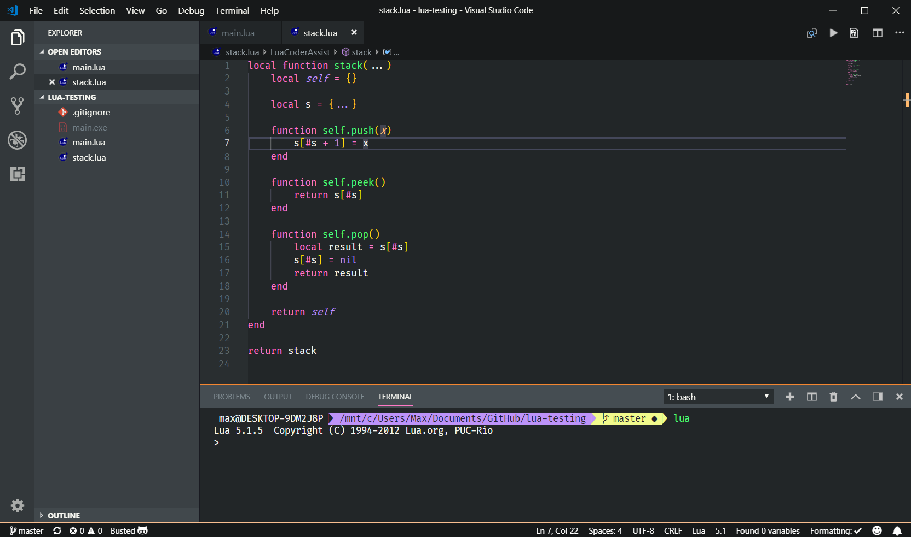

# Golden Dracula for [Visual Studio Code](http://code.visualstudio.com)

> A dark theme for [Visual Studio Code](http://code.visualstudio.com).

Original theme by [Dracula](https://github.com/dracula/visual-studio-code)

Influenced by [Rainglow (Goldfish) Theme](https://github.com/rainglow/vscode)

## License

Copyright for portions of project Foo are held by Dracula Theme as part of the original [Visual Studio Code *Dracula* theme](https://github.com/dracula/visual-studio-code). All other copyright for project *Golden Dracula* are held by Max L (2018).

[MIT License](./LICENSE)